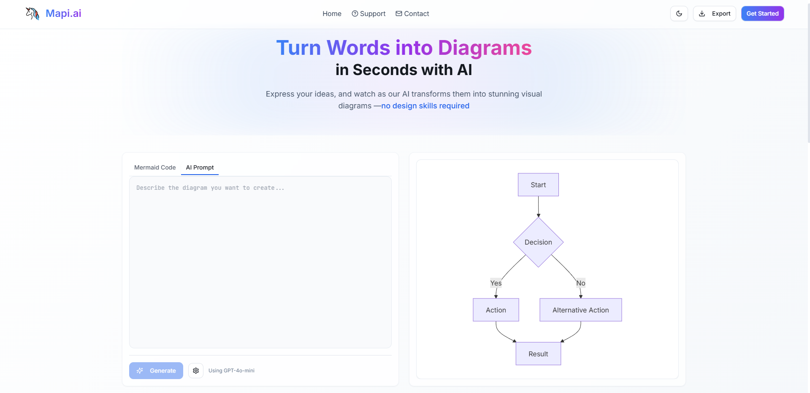
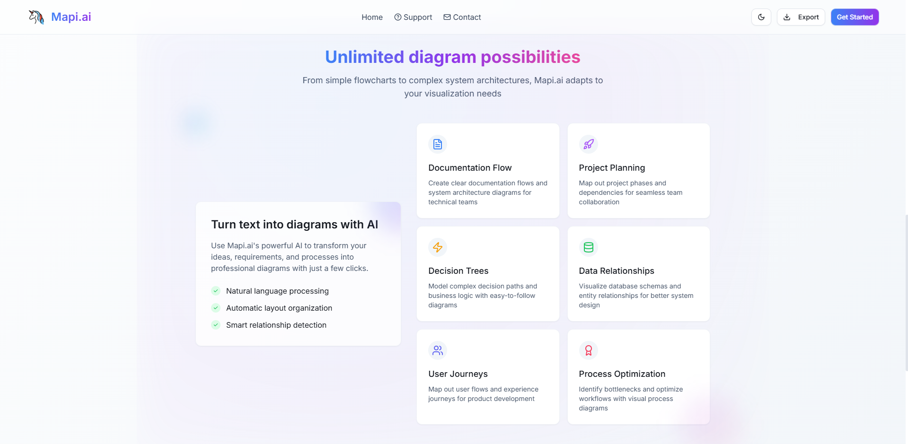

# Mapi.ai

[**Mapi.ai**](https://mapiai.netlify.app/) helps you turn natural language into diagrams in seconds using [Mermaid.js](https://mermaid.js.org/) and AI assistance. Ideal for developers, product managers, educators, and technical writers who want to visually communicate ideas with minimal effort.

## Features

> - AI-Powered Diagram Generation
> - Live Preview  
> - Export Options 
> - Mermaid.js Support 

## Getting Started

Coming soon: instructions on how to run Mapi.ai locally or deploy it.

## Prerequisites

Before running or contributing to Mapi.ai, make sure you have the following installed:

- [Node.js (v18 or higher)](https://nodejs.org/)
- [npm](https://www.npmjs.com/) or [yarn](https://yarnpkg.com/)
- [Git](https://git-scm.com/)
- OpenAI API Key (for GPT-4o-mini integration)

## Export Formats

- PNG (image snapshot)
